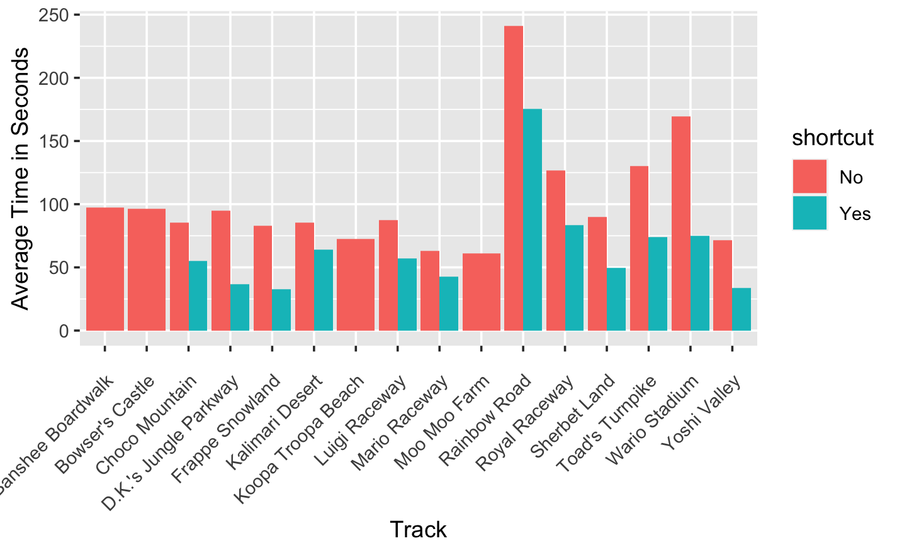
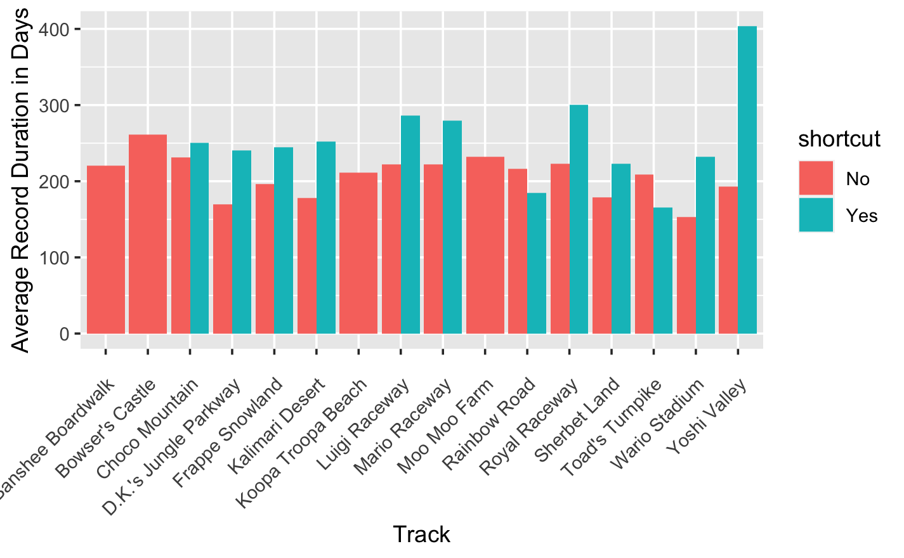
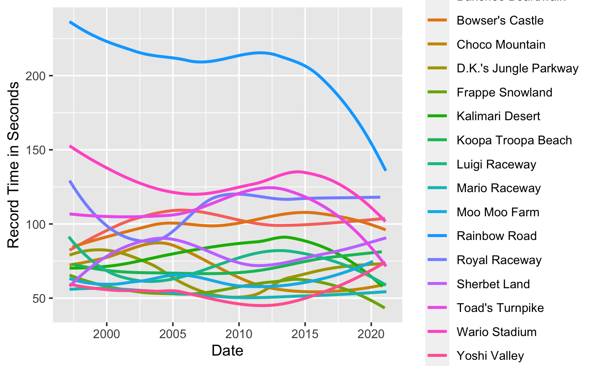

```{r setup, include=FALSE}
knitr::opts_chunk$set(echo = TRUE)
```

For assignment 3, we are going to be using the Mario Kart data again to do some data visualization. Make sure you print your name at the top of the assignment! Before you start, familiarize yourself with the <data:https://github.com/rfordatascience/tidytuesday/tree/master/data/2021/2021-05-25>

## Question 1 (.5pts)

Load the `tidyverse`, `broom` and `ggplot` libraries into R

```{r}

```

## Question 2 (.5 pts)

Load the Mario Data `records.csv` and save it as an object.

```{r}

```

## Question 3 (1 pt)

Create a scatter plot using `geom_point()` with `time` as the x variable and `record_duration` as the y variable.

```{r}
```

## Question 4 (1pts)

Like last week, calculate the average time in seconds and the average record duration, group by track and shortcut. Name the object containing the average time `average_time` and the object containing the average record duration `average_record`

```{r}
```

## Question 5 (4pts)

### Part A

Recreate the below plots.

For the first plot, use `average_time` as your data, and will have the average time as your y variable (this will be whatever you named your variable in Q4) and `track` as your x variable. Use `geom_col(position = "dodge")`, and then label the x and y axis by following what we did in lab. Once you've done this, paste the following to turn the x-ticks to make them readable `+ theme(axis.text.x = element_text(angle = 45, hjust = 1, vjust = 1, margin = margin(t = 10)))`

Use the same formula for the first plot as the second plot. But switch the variables and the labels so that they correspond to `average_record`



```{r}

```



```{r}

```

### Part B

Write a short paragraph interpreting the results of the two plots.

## Question 6 (3 pts)

### Part A

Recreate the below plot:



```{r}
```

### Part B

Write a short sentence or two interpreting the plot.
