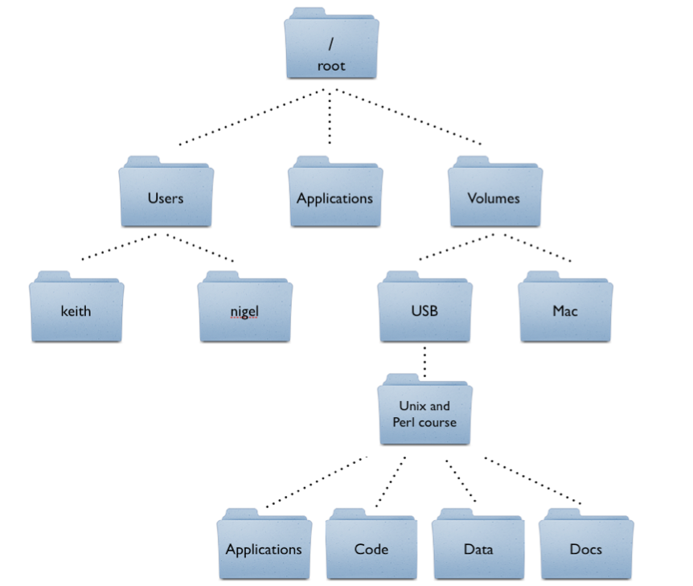

```{r setup, include=FALSE}
knitr::opts_chunk$set(echo = TRUE)

library(tidyverse)
```

# **Introduction and Announcements**

If you are a DSP Student and are requesting extra time for the final exam please make sure to fill out a proctor request by Monday (July 15th)

# **Reading in External Files**

Most of what you do in R will involve manipulating external data. That is why reading in external files is so important! However, this can also become really confusing without knowing some basics about how files are stored on your computer. 

**\*\* QUICK INTERLUDE FOR AN EXPLANATION OF DIRECTORIES \*\***

File directories, also known as file folders or directories, are a way to organize and store files and other directories on a computer's file system. A file directory acts like a container, holding files and other directories in a hierarchical structure. At the top of the hierarchy is the root directory, which serves as the starting point for the file system and is represented by a forward slash (/) on Unix-based systems and by a drive letter followed by a backslash (e.g. C:\\) on Windows-based systems. From the root directory, you can navigate through the file system to access other directories and files.



\*\* **BACK TO R** \*\*

When you go to read in an external file in R, the easiest way to do this is to make sure that the file you want is what is known as your "working directory."  Working directory simply means the folder/file that your R script is in. \

There are many ways to do this, but the most common way is to use the `read_csv()` function. 

To do this, type `read_csv("")` and put quotes inside the brackets, next with your cursor inside the quotes, use the tab key and you will be able to scroll through all the files in your working directory. Click on the one you want to use.

Note `read_csv()`comes from the library `tidyverse`. If you are using base R, you will not be able to do that. More on that later!

Now, let's read in some data:

```{r}
data <- read_csv("data/coffee_survey.csv")
```

In October 2023, ["world champion barista" James Hoffmann](https://www.youtube.com/watch?v=bMOOQfeloH0) and [coffee company Cometeer](https://cometeer.com/pages/the-great-american-coffee-taste-test) held the "Great American Coffee Taste Test" on YouTube, during which viewers were asked to fill out a survey about 4 coffees they ordered from Cometeer for the tasting. [Data blogger Robert McKeon Aloe analyzed the data the following month](https://rmckeon.medium.com/great-american-coffee-taste-test-breakdown-7f3fdcc3c41d).

You can get to know more about this data here: <https://github.com/rfordatascience/tidytuesday/tree/master/data/2024/2024-05-14>

Once you have read in your data, you can quickly explore it either by typing the name of your data object followed by the `$` symbol to quickly select a variable, or by clicking on the name of your object in the workspace browser.

```{r, include=FALSE}
data$age
```

# **Libraries**

What is an R library? Put simply, a library (sometimes called a package) is a collection of functions, documentation (and sometimes data!) that were written by others to expand the capacity of R. For example, say you write a function that you find really useful and you want to share it with the world. If you create a library on the Comprehensive R Archive Network (CRAN), others can download your function as a library. 

**Installing libraries**

To install a library you simply need to type install.packages() and put the name of the library you are wanting to install in quotes like this: install.packages("dplyr"). Once you have installed the package, you are going to need to load it into your R environment. This lets R know what library it needs to load into your environment. To load a library type library() followed by the name of the library you want to load without quotes like this:  library(dplyr)

Example:

```{r}
library(tidyverse)
```

# **Introduction to the Tidyverse**

The Tidyverse is a collection of R packages designed for data science. It includes packages like `dplyr`, `tidyr`, `readr`, `purrr`, `tibble`, `ggplot2`, and more. These packages work together data manipulation and analysis functionalities.

In this introduction, we will use the `coffee_survey.csv` which we have now saved as an object named `data`.

But first, what is tidy data and why is it important? According to [R for Data Science](https://r4ds.had.co.nz/tidy-data.html), you can represent the same underlying data in multiple way but they are not equally easy to use. To make a data set tidy, you must follow three rules:

1.  Each variable must have its own column.

2.  Each observation must have its own row.

3.  Each value must have its own cell.


If a data set is messy, you will often want to put in into the tidy format so that you can do your analysis. But tidyverse is more than just a philosophy for how your data should be organized. It also comes with many useful functions so that you can extract information from your data.

## Cleaning and Transforming Data

### Selecting Columns

When doing analysis, you might want to work with a subset of the variables (you can think of this as a subset of columns). The `select` function allows you to choose specific columns.

```{r}
selected_data <- data %>%
  select(submission_id, age, cups, brew, expertise)

head(selected_data)
```

You'll notice now that the data went from having 57 variables to now only having 5 variables `submission_id`, `age`, `cups`, `brew` and `expertise`. This can be really helpful to make your data more manageable.

### Filtering Rows

To filter rows based on specific conditions, use the `filter` function. For example, you can filter for participants who drink more than 3 cups of coffee per day.

```{r}
heavy_drinkers <- data %>%
  filter(as.numeric(cups) > 3)
```

### Creating New Columns

You can create new columns using the `mutate` function. For example, you can create a new column that categorizes participants based on their expertise.

```{r}
categorized_data <- data %>%
  mutate(expertise_level = ifelse(expertise < 3, "Novice",
                           ifelse(expertise < 7, "Intermediate", "Expert")))

```

### Summarizing Data

The `summarize` function, combined with `group_by`, allows you to calculate summary statistics for groups within your data.

```{r}
average_expertise <- data %>%
  group_by(gender) %>%
  summarize(mean_expertise = mean(expertise, na.rm = TRUE)) # this creates a new variable called mean_expertise
```

## Practice Questions

**Question 1**

Read in the external data file `records.csv` and name your object `df`. This data contains world records for the racing game Mario Kart on the Nintendo 64.

You can (and should!) read more about this data here: <https://github.com/rfordatascience/tidytuesday/tree/master/data/2021/2021-05-25>

```{r}
# Your code here 
```

**Question 2**

Use the `mean()`, `median()` and `mode()` functions to calculate the mean median and mode of the `time` variable

\*hint you will need to use `$` to select the correct column

```{r}
# Your code here 
```

**Question 3**

Group the data by track, and then calculate the mean again. Save this new dataset as `average_track_time`

```{r}
# Your code here 
```

**Question 4**

Go to: <https://dplyr.tidyverse.org/reference/arrange.html#arguments>

And figure out how to use the `arrange()` function to sort `average_track_time` by mean_by_track.

What track has the fastest average time?

```{r}
# Your code here.. 
```

**Question 5**

Go to: <https://dplyr.tidyverse.org/reference/desc.html>

And figure out how to use the `desc`function within `arrange` to sort `average_track_time` by mean_by_track.

What track has the slowest average time?\

```{r}
# Your code here
```

**Question 6**

Use the `mutate` function and `ifelse` to make a new variable within `df` called average. If time is less than 90 than label it as "below average" if time is greater than 90 label it as "above average" and if time is exactly 90 label it as "average", else if none of these options are met tell R to label it as NA.

```{r}
# Your code here
```

**Question 7**

Filter the data based on if time is \> than 90 seconds

```{r}
# Your code here
```

**Question 8**

Select only the variables `shortcut`, `time` and `track`, name this `df_sm`

```{r}
# Your code here
```

**Question 9**

Calculate the average time per track and group by both `shortcut` and `track`

```{r}
# Your code here
```
